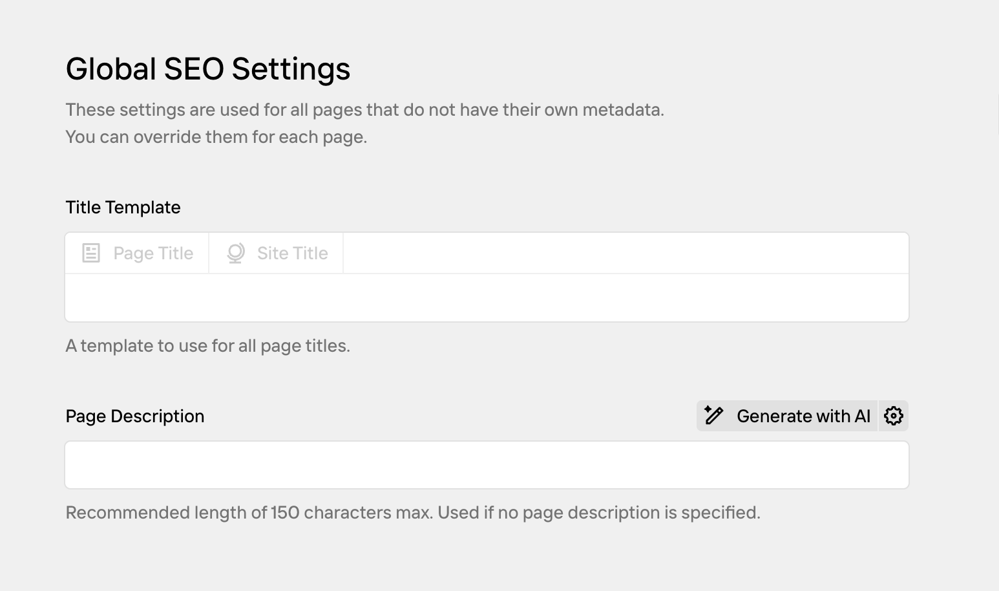
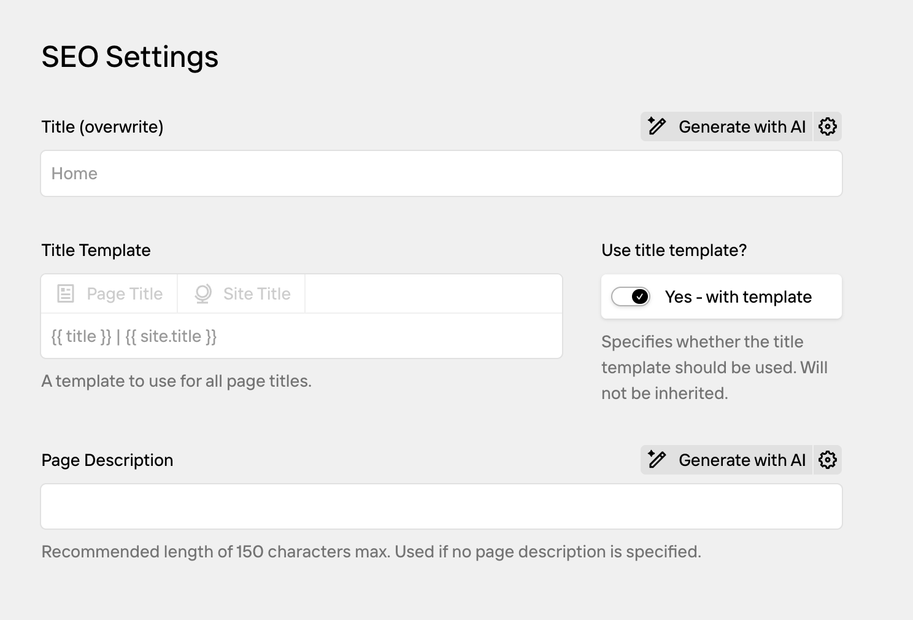
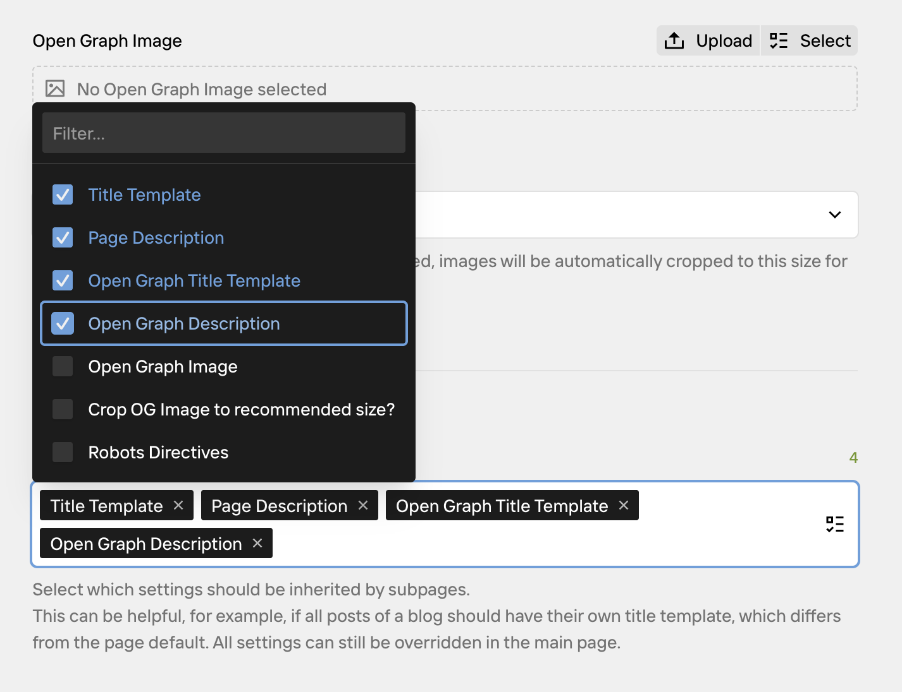

In the Quickstart, you installed Kirby SEO and saw meta tags appear in your source code. Now let's look at how to control what shows up, and where.

## Start with a side-wide default

Open the Panel, and click on "Metadata & SEO". You'll see something like this:



Quite empty, but these are your global defaults. Every page that doesn't have its own meta data will use what you set here.

### Meta title templates

You probably don't want to write a custom meta title for every page. Kirby SEO lets you define a **title template** at the site level.

Go to the Site SEO tab and find the title template field. Click the buttons to insert placeholders like **Page Title** or **Site Title**, and type any separator you want between them.

A template like `Page Title | Site Title` turns a page called "About" on a site called "My Blog" into:

```
About | My Blog
```

Every page that doesn't have a custom meta title will use this pattern automatically.

### Set a default description

Below that, you'll find the Page Description field. Enter a default description like "A blog about good food." and save.

Open any page on your site and view the source. Every page shows this description, because no page has its own yet.

### Override on a single page

Navigate to a specific page in the Panel, and open its Metadata & SEO tab. You'll find a slightly different interface than the site tab:



Enter a different description. Save and reload that page in the browser.

That page now shows its own description. Every other page still shows "A blog about good food."

### Remove the override

Delete the description you just entered on the page and save. Reload — the page falls back to the site-wide default again.

What you just experienced is the **Meta Cascade**. Kirby SEO looks for values in multiple places and uses the most specific one it finds:

1. **Page fields**: the Metadata & SEO tab tab on a specific page
2. **Programmatic content**: values set in a Page Model via `metaDefaults()`
3. **Parent page**: inherited from the parent page (if enabled)
4. **Site globals**: the Metadata & SEO tab on the Site
5. **Plugin defaults**

The idea is simple: you set sensible defaults once at the site level, and only override where you need something different. Most pages will never need their own Metadata & SEO tab filled in at all.

## Inheriting settings

So far you've seen two levels: site defaults and page overrides. But what if you have a section of your site — like a blog — where all pages should share specific settings that are different from the rest of your site?

Open a page's Metadata & SEO tab and use the Inherit settings field. Select which settings should be passed down to its child pages: title templates, descriptions, Open Graph, robots directives, or all at once. Child pages can still override anything individually.



## Open Graph & Social

When someone shares a link to your site on Facebook, Mastodon, Slack or WhatsApp, these platforms look for Open Graph tags in your HTML to build a preview card. The [Open Graph Protocol](https://ogp.me/) is a standard originally created by Facebook that defines how a page's title, description and image appear when shared.

Kirby SEO generates these tags automatically. The SEO tab has separate fields for Open Graph titles, descriptions and images,but you usually don't need to fill them in. If you don't set an OG title, the plugin uses your meta title. If you don't set an OG image, it uses the default from your site settings.

Set a default OG image in the Site SEO tab so every shared link has a preview image, even if you don't set one per page.

## What's next

You now know how to control your meta tags, title templates and social previews. The rest of the docs cover individual features in detail:

// TODO: add links
