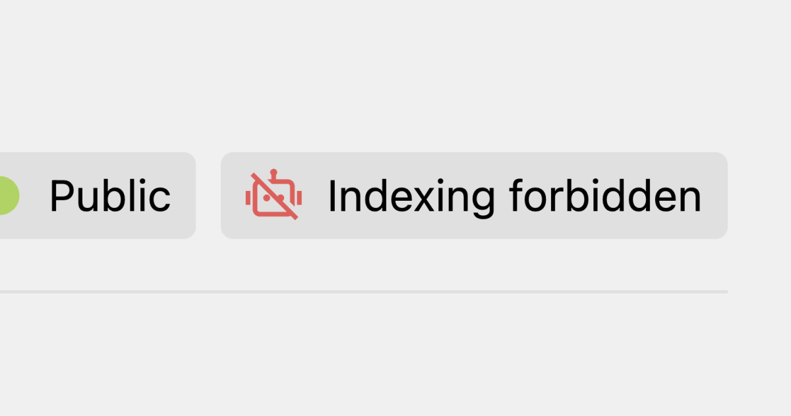
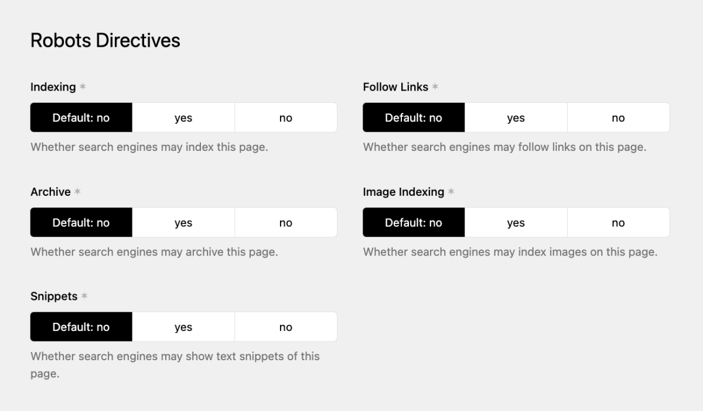

Search engines and AI providers use programs called crawlers to discover and index pages on the web. You can tell these crawlers which pages they're allowed to index and which ones they should skip. These are not hard blocks: crawlers don't *have* to follow them. But all major search engines do respect them.

Kirby SEO does this in two ways: a global `robots.txt` file and per-page `<meta name="robots">` tags. Both are generated automatically. Most of the indexing control happens through meta tags, while `robots.txt` acts as a global safety net.

## robots.txt

Kirby SEO generates a `robots.txt` automatically. You don't need to create or maintain it yourself. Visit `example.com/robots.txt` to see yours.

By default, the output looks like this:

```txt
User-agent: *
Allow: /
Disallow: /panel

Sitemap: https://example.com/sitemap.xml
```

- `User-agent: *` applies the rules to all crawlers.
- `Allow: /` permits crawling the entire site.
- `Disallow: /panel` blocks the Kirby Panel from being crawled.
- `Sitemap:` points crawlers to your sitemap (only shown when the [sitemap feature](1_features/01_sitemap) is active).

The `robots.txt` does **not** list individual pages. It only sets broad rules. To control indexing for a specific page, you need meta tags (see below).

### Debug mode

When Kirby's debug mode is on, the `robots.txt` blocks all crawlers:

```txt
User-agent: *
Disallow: /
```

This way your development or staging site doesn't end up in search results.

If you need to customize the `robots.txt`, see [Customizing robots.txt](2_customization/02_robots-txt).

## Robots meta tags

The `<meta name="robots">` tag tells search engines what to do with a specific page: whether to index it, follow its links, and more.

Kirby SEO adds this tag to every page automatically.

### Default behavior

The plugin follows page status in Kirby:

- **Listed** pages are visible to search engines
- **Unlisted** pages are hidden from search engines
- **Draft** pages are not publicly accessible

In debug mode, **all** pages are hidden from search engines regardless of their status.

### Overriding robots settings

Robots meta tags follow the same [Meta Cascade](0_getting-started/1_your-first-meta-tags) as all other fields. The defaults above kick in when nothing else is set, so you can override them:

- Set a page's robots fields in its **Metadata & SEO** tab to override just that page.
- Set the robots fields on the **Site** to override all pages at once.

One thing to watch out for: if you hard-set a value at the site level (e.g. setting "Index" to "No" instead of leaving it on "Default"), every page without its own override will follow that setting through the cascade. Leave fields on "Default" if you want the plugin to decide based on page status.

### Robots indicator in the Panel

Kirby SEO has a page view button that shows the current robots status at a glance. You need to add it to your page blueprints manually:

```yaml
# site/blueprints/pages/default.yml
buttons:
  - open
  - preview
  - '-'
  - settings
  - languages
  - status
  - robots
```

The indicator has three states:

- **Green**: the page is visible to search engines
- **Yellow**: the page is indexed, but with some restrictions
- **Red**: the page is hidden from search engines



Clicking it takes you straight to the SEO tab, so you can quickly spot which pages are excluded from search engines.

### Disabling per-page robots fields



Our suggestion: hide the per-page robots fields unless you actually need them. The defaults are good enough for the vast majority of sites, and the individual settings tend to confuse editors more than they help. You can disable them entirely:

```php
// site/config/config.php
return [
  'tobimori.seo' => [
    'robots' => [
      'pageSettings' => false,
    ],
  ],
];
```

This hides the robots fields on both page and site level. The defaults (based on page status and debug mode) still apply.

For more ways to customize robots behavior, see [Customizing robots.txt](2_customization/02_robots-txt).

<details>
<summary>Tags suppressed by noindex</summary>

When a page has `noindex`, Kirby SEO also removes some related tags that don't make sense on a page hidden from search engines:

- `<link rel="canonical">` is not rendered
- `<meta property="og:url">` is not rendered
- `<link rel="alternate" hreflang="...">` tags are not rendered

Other tags like `<title>`, `<meta name="description">` and Open Graph tags are still rendered.

</details>
