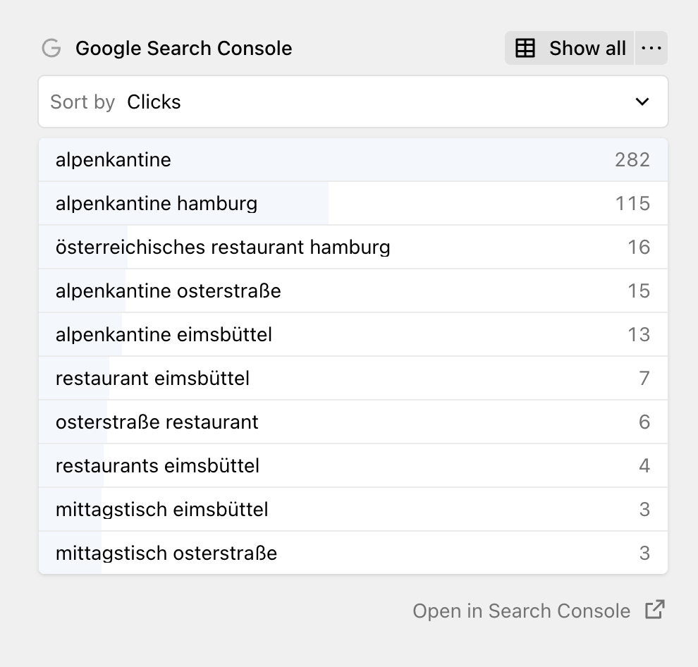

Kirby SEO can pull data from [Google Search Console](https://search.google.com/search-console) directly into the Panel. Editors can see search performance right next to their content, without needing their own Google account or leaving the Panel. You see which search queries lead people to each page, how many clicks and impressions you get, your click-through rate, and your average position in search results.

The data shows up in a section on both the Site and individual page views. On a page, the queries are filtered to that specific page. On the Site view, you see all queries across your entire site. The section shows the top 10 search queries, sorted by clicks. You can switch the sorting to impressions, CTR, or position.

Click **Show all** to open a full table with all queries and all four metrics at once. There's also a direct link to open the page in Google Search Console if you want to dig deeper.

Data is cached for 24 hours, so it won't hit Google's API on every page load.

## Connecting your Google account

**IMPORTANT:** The following section describes a feature that is not implemented yet. For now, the Search Console integration requires your own GSC credentials.

The Google Search Console section needs access to your Google account. To keep setup simple, API requests to Google are proxied through a server operated by Love & Kindness GmbH (the company behind Kirby SEO). This proxy mode requires an active Kirby SEO license, which is used only for rate limiting. We do not log the content of any requests or responses, so we cannot see the actual search data for your site. The source code for the proxy is [open source on GitHub](https://github.com/tobimori/kirby-seo-gsc-proxy).

1. Open the Panel and navigate to any page with the SEO tab.
2. In the Google Search Console section, click **Connect**.
3. Google asks you to sign in and grant read-only access to your Search Console data.
4. Back in the Panel, select which Search Console property to use. If your domain is already registered in Google Search Console, it will be pre-selected.

The section starts showing data once the property is selected.

If you'd rather not use the proxy, you can connect with your own Google OAuth credentials instead. See [Setting up your own GSC credentials](2_customization/07_gsc-setup) for details.

