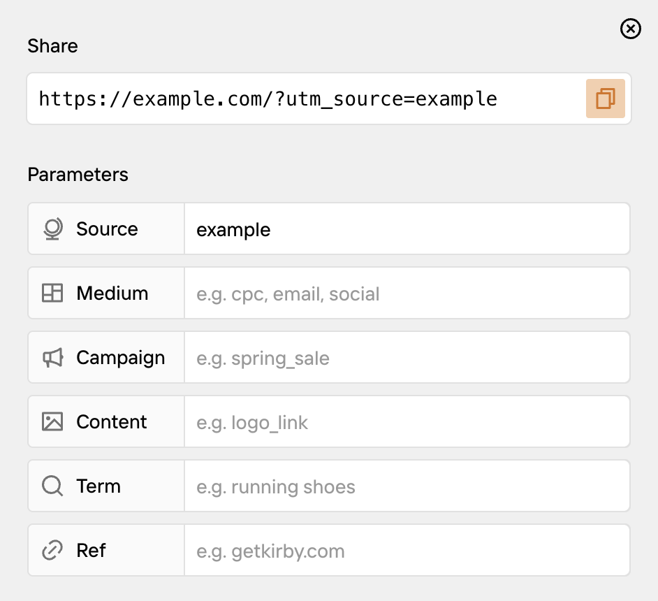

When you share a link to your site in a newsletter, a social media post, or an ad, you want to know which links actually bring in traffic. UTM parameters are tags you add to a URL so analytics tools like Google Analytics can tell you exactly where a visitor came from.

A URL with UTM parameters looks like this:

```
https://example.com/blog/my-post?utm_source=newsletter&utm_medium=email&utm_campaign=spring-sale
```

Kirby SEO adds a **UTM Share** button to your page views. Click it to open a dialog where you can fill in the parameters and copy the resulting URL.



The dialog has five standard UTM parameters:

- `utm_source`: where the traffic comes from (e.g. `google`, `newsletter`)
- `utm_medium`: the type of channel (e.g. `cpc`, `email`, `social`)
- `utm_campaign`: the name of the campaign (e.g. `spring_sale`)
- `utm_content`: to tell apart different links in the same campaign (e.g. `logo_link`)
- `utm_term`: the keyword, for paid search ads (e.g. `running shoes`)

You don't need all five. Most of the time, `utm_source`, `utm_medium`, and `utm_campaign` are enough.

There's also a `ref` field. This is not part of the UTM standard, but many analytics tools (like Plausible and Pirsch) use it as a lightweight way to track the referring site.

To add the button to your page blueprints:

```yaml
# site/blueprints/pages/default.yml
buttons:
  - open
  - preview
  - '-'
  - settings
  - languages
  - status
  - utm-share
```
